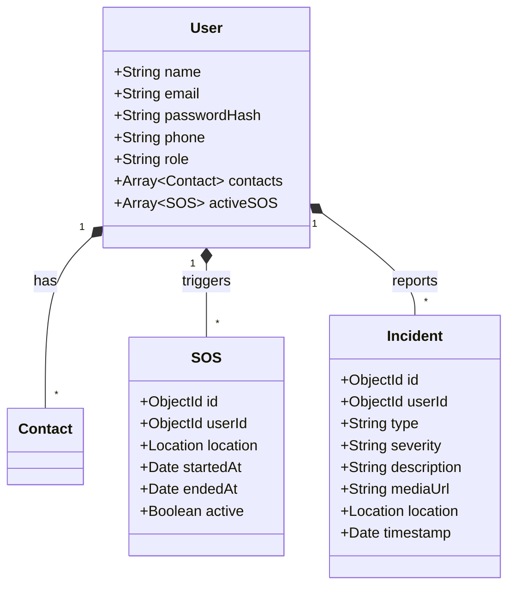
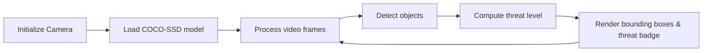

# PROJECT REPORT

## ON

# "HERSECURE: ADVANCED AI DEFENSE SYSTEM FOR WOMEN SAFETY"

### FOR

### D Y PATIL UNIVERSITY PUNE AMBI

<br/>

**SUBMITTED BY**

**[PRN NO.]**
**[NAME OF STUDENT]**

<br/>

### D Y PATIL UNIVERSITY PUNE AMBI
### BACHELOR OF COMPUTER APPLICATION
### SCHOOL OF MANAGEMENT
### 2025-2026

---

## TABLE OF CONTENTS

| Sr. No. | Topic | Page No. |
|---------|-------|----------|
| | **Preliminary Pages** | |
| | Title Page | i |
| | Certificate from Company | ii |
| | Certificate from Institute | iii |
| | Declaration by Student | iv |
| | Certificate from Project Guide | v |
| | Acknowledgement | vi |
| | Abstract | vii |
| | **CHAPTER 1: INTRODUCTION** | |
| 1.1 | Project Overview | 1 |
| 1.2 | Existing System and Need for the System | 2 |
| 1.3 | Scope of Work | 4 |
| 1.4 | Operating Environment – Hardware and Software | 5 |
| 1.5 | Detailed Description of Technology Used | 6 |
| | **CHAPTER 2: PROPOSED SYSTEM** | |
| 2.1 | Proposed System | 9 |
| 2.2 | Objectives of System | 10 |
| 2.3 | User Requirements (Functional & Non-Functional) | 11 |
| | **CHAPTER 3: ANALYSIS & DESIGN** | |
| 3.1 | System Architecture Diagram | 13 |
| 3.2 | Class Diagram | 14 |
| 3.3 | Use Case Diagrams | 15 |
| 3.4 | Module Hierarchy Diagram | 16 |
| 3.5 | Component Diagram | 17 |
| 3.6 | Deployment Diagram | 18 |
| 3.7 | Module Specifications | 19 |
| 3.8 | Data Flow Diagrams (DFD Level 0, 1, 2) | 22 |
| 3.9 | Entity Relationship Diagram | 23 |
| 3.10 | Website Map / Sitemap Diagram | 24 |
| 3.11 | User Interface Design (Screenshots) | 25 |
| 3.12 | Database Table Specifications | 26 |
| 3.13 | API Endpoint Specifications | 28 |
| 3.14 | Test Procedures and Implementation | 30 |
| | **CHAPTER 4: USER MANUAL** | |
| 4.1 | Installation & Setup Guide | 32 |
| 4.2 | User Manual | 33 |
| 4.3 | Operations Manual / Menu Explanation | 34 |
| 4.4 | Program Specifications / Flowcharts | 35 |
| | **CHAPTER 5: CONCLUSION** | |
| 5.1 | Drawbacks and Limitations | 37 |
| 5.2 | Proposed Enhancements | 38 |
| 5.3 | Conclusion | 39 |
| | Bibliography / References | 40 |
| | Annexures | 41 |

---

## ABSTRACT

**HerSecure** is a comprehensive, AI-powered women's safety platform developed using modern full-stack web technologies. The system addresses the critical need for proactive personal safety by integrating real-time threat detection using TensorFlow.js computer vision, intelligent safe-route navigation using OpenStreetMap and OSRM, emergency SOS alerts with automated SMS notifications via Twilio, and a community-driven safety reporting mechanism.

Unlike traditional safety applications that operate reactively, HerSecure employs a multi-layered defense strategy: an AI-powered threat scanner that runs entirely on-device for privacy, a tactical route navigator that evaluates safety scores based on crime data and community reports, a one-tap SOS system that simultaneously alerts emergency contacts with live GPS coordinates, and an AI chatbot (GuardianAI) that provides real-time safety guidance during crisis situations.

The platform is built on Next.js 16 with TypeScript, uses MongoDB Atlas for persistent data storage, and features a premium glassmorphic user interface with rich animations powered by Framer Motion. The system demonstrates the practical application of client-side machine learning, real-time communication protocols, and modern web APIs in creating a meaningful social-impact application.

**Keywords:** Women Safety, Artificial Intelligence, TensorFlow.js, Real-time Threat Detection, SOS Emergency System, Safe Route Navigation, Next.js, MongoDB, Twilio SMS

---

## ACKNOWLEDGEMENT

I would like to express my sincere gratitude to all who have contributed to the successful completion of this project.

I am deeply thankful to my project guide **[Guide Name]** for their constant guidance, encouragement, and valuable suggestions throughout the development of this project.

I extend my heartfelt thanks to the **Head of Department** and the faculty members of the **School of Management, D Y Patil University, Pune Ambi**, for providing the necessary resources and infrastructure to carry out this work.

I also wish to acknowledge the open-source communities behind Next.js, TensorFlow.js, MongoDB, and OpenStreetMap, whose tools and documentation made this project possible.

Finally, I am grateful to my family and friends for their unwavering support and motivation.

**[Student Name]**
**[Date]**

---

## CHAPTER 1: INTRODUCTION

### 1.1 Project Overview

**HerSecure** is an advanced, AI-integrated security ecosystem developed to address the escalating safety concerns faced by women in urban and remote environments. The project is conceptualized as a "Digital Guardian" that transitions from traditional reactionary safety measures to a proactive, intelligence-led defense posture.

The core philosophy behind HerSecure is to empower users with military-grade situational awareness through a minimalist, high-performance interface. Rather than simply responding to emergencies after they occur, HerSecure utilizes predictive neural networks to scan environments in real-time, optimizes travel routes for safety rather than just speed, and maintains a persistent "Guardian Network" of trusted contacts who receive automated alerts during critical events.

**Key Innovation Areas:**

1. **Client-Side AI Processing:** All computer vision operations run directly on the user's device using TensorFlow.js. This means no video feed ever leaves the device, ensuring complete privacy while providing real-time threat analysis.
2. **Safety-Optimized Navigation:** Unlike Google Maps or Waze which optimize for speed or distance, HerSecure's route navigator calculates a "Safety Score" for each possible path based on crime data, street lighting conditions, CCTV coverage, police patrol zones, and community-submitted reports.
3. **Multi-Modal SOS Trigger:** The emergency system supports four trigger methods — Manual button press, Timer-based countdown, Voice activation, and Shake gesture — ensuring the user can call for help regardless of their physical situation.
4. **Community Intelligence Network:** Users can anonymously report unsafe areas, creating a crowd-sourced safety map that improves over time. Reports include type classification (harassment, theft, poor lighting, etc.), severity ratings, and optional media evidence.
5. **AI Safety Chatbot:** GuardianAI is an integrated chatbot that provides real-time safety guidance, emotional support during crises, and actionable advice tailored to the user's situation.

### 1.2 Existing System and Need for the System

#### 1.2.1 Analysis of Existing Systems

The current landscape of women's safety applications suffers from several critical limitations:

| Limitation | Description | Impact |
|-----------|-------------|--------|
| **Reactionary Design** | Most apps require the user to unlock their phone, locate the app, and manually press a button — steps that are often impossible during an active threat scenario. | Delayed emergency response; critical seconds lost. |
| **Lack of Environmental Intelligence** | Standard safety apps are simple communication bridges. They cannot "see" or "understand" the user's physical surroundings. | Users cannot get advance warnings about potentially dangerous environments. |
| **Fragmented Evidence** | Incident reports are often lost, stored locally on devices, or siloed within individual apps, making it difficult for law enforcement to access digital evidence. | Reduced prosecution rates; inability to identify crime patterns. |
| **Static Routing** | Traditional navigation apps (Google Maps, Apple Maps) only optimize for distance or time. They completely ignore safety-critical factors like street lighting, historical crime data, and police patrol proximity. | Users may be routed through unsafe areas, especially at night. |
| **No AI Integration** | Existing apps do not leverage artificial intelligence for threat detection, behavioral analysis, or predictive safety. | Missed opportunities for proactive safety measures. |
| **Limited Communication** | Most apps only send a basic text message or make a phone call. They do not provide real-time location tracking or contextual information to responders. | Emergency contacts receive limited information and cannot track the user's movement in real-time. |

#### 1.2.2 Comparison with Existing Applications

| Feature | bSafe | Shake2Safety | Life360 | **HerSecure** |
|---------|-------|-------------|---------|---------------|
| SOS Alert | ✅ | ✅ | ✅ | ✅ |
| Live Location Sharing | ✅ | ❌ | ✅ | ✅ |
| AI Threat Detection | ❌ | ❌ | ❌ | ✅ |
| Safe Route Navigation | ❌ | ❌ | ❌ | ✅ |
| Community Safety Reports | ❌ | ❌ | ❌ | ✅ |
| AI Safety Chatbot | ❌ | ❌ | ❌ | ✅ |
| Multi-Trigger SOS | ❌ | ✅ (Shake) | ❌ | ✅ (4 modes) |
| On-Device AI | ❌ | ❌ | ❌ | ✅ |
| Secure Evidence Vault | ❌ | ❌ | ❌ | ✅ |
| Admin Dashboard | ❌ | ❌ | ❌ | ✅ |

#### 1.2.3 The Need for HerSecure

Based on the analysis above, there is a critical requirement for a system that can:

- **Trigger Instantly:** Utilizing device hardware (accelerometers, microphones) for gesture‑based and voice‑activated SOS, bypassing the need to manually interact with the phone.
- **Analyze in Real-Time:** Using Computer Vision (TensorFlow.js COCO‑SSD model) to detect people, vehicles, and potential threats automatically through the device camera.
- **Navigate Safely:** Providing AI‑optimized walking routes that factor in street lighting, crime history, CCTV coverage, and community safety scores.
- **Sync Globally:** Leveraging cloud‑native protocols (Twilio SMS API) to broadcast location data and emergency alerts to guardians within milliseconds.
- **Preserve Evidence:** Storing encrypted incident logs with media attachments, timestamps, and geolocation data that are immediately available to authorized parties.
- **Provide AI Guidance:** Offering real-time, contextual safety advice through an AI chatbot during crisis situations.

### 1.3 Scope of Work

The project scope encompasses the design, development, and deployment of **eight core security modules**:

| Module | Description |
|--------|-------------|
| **1. Neural SOS Engine** | A multi‑trigger emergency system (Manual, Timer, Voice, Shake) that activates high‑decibel alarms, records ambient audio, captures battery level, and broadcasts live GPS coordinates to all registered emergency contacts via SMS. Automatically deactivates previous SOS signals when a new one is triggered. |
| **2. AI Threat Scanner** | An integrated computer vision module using TensorFlow.js with the COCO‑SSD MobileNet v2 model to identify people, vehicles (cars, trucks, motorcycles), and other objects in the user's immediate visual field. Runs entirely on‑device for privacy. Provides real‑time bounding box overlays with confidence scores and a three‑tier threat assessment (Safe/Elevated/Critical). |
| **3. Tactical Safe Route Navigator** | A routing engine that uses OpenStreetMap (Nominatim) for geocoding and OSRM for pedestrian route calculation. Evaluates "Safety Scores" for each route alternative based on proximity to known crime zones, poorly‑lit areas, and community‑reported incidents. Displays routes on a dark‑themed Leaflet map with color‑coded overlays. |
| **4. Guardian Network Hub** | A secure contact management system where users can add, view, and remove trusted emergency contacts ("Guardians"). Each contact stores name, phone number, and relationship type. During SOS events, all guardians receive automated SMS alerts via Twilio containing the user's name, live Google Maps location link, and battery percentage. |
| **5. Community Safety Reporting** | An anonymous incident reporting system where users can flag unsafe areas with type classification (harassment, theft, assault, poor lighting, unsafe area, suspicious activity, safe zone), severity ratings (low/medium/high/critical), text descriptions, and optional media attachments (images/videos). Reports include geocoded locations, upvote counts, and auto‑expire after 7 days. |
| **6. GuardianAI Chatbot** | An AI‑powered safety assistant built on the Pollinations.ai free API (with fallback mechanisms). Provides calm, practical safety guidance, emotional support during crises, and concise, actionable advice. Operates as a side‑drawer chat interface accessible from any page. |
| **7. Secure Location Sharing** | A secure, temporary location‑sharing system that generates cryptographic tokens (using Node.js `crypto` module) for time‑limited location links. Supports configurable expiry (1h/12h/24h) and optional "Burn After Read" functionality where the link self‑destructs after being viewed once. |
| **8. Admin Dashboard** | A role‑based administrative panel for monitoring system‑wide statistics including total registered users, total incident count, active SOS signals with user details, and recent incident reports. Protected by JWT‑based role verification (admin role required). |

### 1.4 Operating Environment – Hardware and Software

#### 1.4.1 Client‑Side Requirements

| Category | Requirement | Details |
|----------|-------------|---------|
| **Processor** | Multi‑core CPU | Required for TensorFlow.js model inference at acceptable frame rates |
| **RAM** | Minimum 4 GB | Needed for efficient neural network execution in the browser |
| **Camera** | 720p or higher | Required for the AI Threat Scanner module |
| **GPS/GNSS** | < 10 m accuracy | Required for SOS location broadcasting and safe route navigation |
| **Accelerometer** | Standard IMU | Required for "Shake‑to‑Trigger" SOS functionality |
| **Network** | Stable internet | Required for API calls, map tiles, SMS broadcasting, and AI chat |
| **Browser** | Chrome 110+, Safari 16+, Firefox 100+, Edge 110+ | Must support WebGL 2.0, MediaDevices API, Geolocation API, Web Crypto API |
| **Storage** | 100 MB free | For browser cache, TensorFlow.js model weights, and service worker assets |

#### 1.4.2 Server‑Side Requirements

| Category | Requirement | Details |
|----------|-------------|---------|
| **Runtime** | Node.js v20.x or higher | Required for Next.js 16 server components and API routes |
| **Database** | MongoDB Atlas (v7+) | Cloud‑native NoSQL database for scalable document storage |
| **Package Manager** | npm v10+ or yarn v4+ | For dependency resolution and script execution |
| **Memory** | 1 GB RAM minimum | For Next.js server‑side rendering and API route handling |
| **Deployment** | Vercel / AWS / DigitalOcean | Platform supporting Node.js with edge function capabilities |

#### 1.4.3 Development Environment

| Tool | Version | Purpose |
|------|---------|---------|
| VS Code | Latest | Primary IDE with TypeScript IntelliSense |
| Git | 2.40+ | Version control and collaboration |
| Postman | Latest | API testing and documentation |
| MongoDB Compass | Latest | Database visualization and query testing |
| Chrome DevTools | Latest | Frontend debugging, network analysis, performance profiling |

### 1.5 Detailed Description of Technology Used

#### 1.5.1 Frontend Technologies

| Technology | Version | Role in Project |
|-----------|---------|-----------------|
| **Next.js** | 16.1.6 | Full‑stack React framework. Provides file‑system based routing (App Router), server‑side rendering (SSR) for fast initial loads, API routes for backend logic, and optimized asset handling with automatic code splitting. |
| **React** | 19.2.3 | UI library for building component‑based user interfaces. Version 19 brings concurrent rendering features and improved server component support. |
| **TypeScript** | 5.x | Superset of JavaScript adding static type checking. Ensures type safety across all models, API routes, and components. |
| **Tailwind CSS** | 4.x | Utility‑first CSS framework for rapid UI development. Provides consistent design tokens (spacing, colors, typography) and eliminates the need for custom CSS files. |
| **Framer Motion** | 12.34.3 | Production‑ready animation library for React. Used for page transitions, modal entry/exit animations, 3D tilt card effects, loading spinners, pulse animations on SOS status indicators, and micro‑interactions on buttons and cards. |
| **Lucide React** | 0.575.0 | Modern icon library (fork of Feather Icons) providing 1000+ SVG icons. |
| **TensorFlow.js** | 4.22.0 | Client‑side machine learning library. Enables running pre‑trained COCO‑SSD object detection models directly in the browser using WebGL acceleration. |
| **COCO‑SSD** | 2.2.3 | Pre‑trained object detection model capable of identifying 80 object classes. Uses the `lite_mobilenet_v2` base model for optimal performance on mobile devices. |

#### 1.5.2 Backend Technologies

| Technology | Version | Role in Project |
|-----------|---------|-----------------|
| **Next.js API Routes** | 16.1.6 | Server‑side API endpoints defined as `route.ts` files within the `app/api/` directory. |
| **NextAuth.js** | 4.24.13 | Authentication library providing JWT‑based session management. Configured with a Credentials Provider for email/password login. |
| **Mongoose** | 9.2.2 | MongoDB ODM providing schema‑based data modeling. |
| **bcryptjs** | 3.0.3 | Password hashing library using the bcrypt algorithm. |
| **Twilio** | 5.12.2 | Cloud communications API for sending SMS messages. |
| **crypto (Node.js)** | — | Cryptographic module for generating secure random tokens. |

#### 1.5.3 External APIs & Services

| Service | Purpose | Integration Details |
|---------|---------|---------------------|
| **OpenStreetMap Nominatim** | Geocoding (address → coordinates) | Free geocoding API with viewbox bias. |
| **OSRM** | Pedestrian route calculation | Provides walking‑optimized routes with alternatives. |
| **CartoDB Dark Tiles** | Map base layer | Dark‑themed raster tiles for tactical map aesthetic. |
| **Pollinations.ai** | AI chatbot responses | Free AI text generation API (no API key required). |
| **MongoDB Atlas** | Cloud database | Managed MongoDB cluster accessed via `MONGODB_URI`. |

#### 1.5.4 Key Libraries & Tools

| Library | Version | Purpose |
|---------|---------|---------|
| **react-hot-toast** | 2.6.0 | Lightweight toast notification system. |
| **react-hook-form** | 7.71.2 | Performant form handling with built‑in validation. |
| **@hookform/resolvers** | 5.2.2 | Integration layer connecting react‑hook‑form with Zod. |
| **zod** | 4.3.6 | TypeScript‑first schema validation library. |
| **axios** | 1.13.5 | Promise‑based HTTP client (fallback to native fetch). |
| **socket.io-client** | 4.8.3 | Real‑time WebSocket client for bi‑directional communication during SOS events. |
| **clsx** | 2.1.1 | Utility for conditionally joining CSS class names. |
| **tailwind-merge** | 3.5.0 | Utility for merging Tailwind CSS classes without conflicts. |
| **Leaflet** | 1.9.4 | Open‑source interactive map library. |

---

## CHAPTER 2: PROPOSED SYSTEM

### 2.1 System Architecture Overview

```mermaid
flowchart LR
    subgraph Frontend
        UI[User Interface (Next.js + React)]
        Threat[Threat Scanner (TensorFlow.js)]
        Map[Safe Route (Leaflet + OSRM)]
        Chat[GuardianAI Chat (Pollinations.ai)]
    end
    subgraph Backend
        API[Next.js API Routes]
        Auth[NextAuth.js]
        DB[MongoDB Atlas]
        SMS[Twilio Service]
    end
    UI -->|REST Calls| API
    Threat -->|WebGL Model| UI
    Map -->|HTTP Requests| API
    Chat -->|POST /api/chat| API
    API -->|CRUD| DB
    API -->|SMS Alerts| SMS
    Auth -->|Session JWT| UI
```

### 2.2 Module Descriptions (expanded)

| Module | Core Functions | Key Endpoints |
|--------|----------------|---------------|
| **Neural SOS Engine** | Trigger SOS, record audio, send SMS, deactivate SOS | `POST /api/sos`, `PATCH /api/sos/:id`, `GET /api/sos` |
| **AI Threat Scanner** | Load COCO‑SSD model, process video frames, compute threat level | Integrated client‑side; no server endpoint |
| **Safe Route Navigator** | Geocode address, request routes, compute safety scores, render map | `GET /api/safe-route?origin=&dest=` |
| **Guardian Network Hub** | Manage contacts, retrieve guardian list | `GET /api/contacts`, `POST /api/contacts`, `DELETE /api/contacts/:id` |
| **Community Safety Reporting** | Submit reports, query nearby reports, auto‑expire | `POST /api/safety-report`, `GET /api/safety-report?lat=&lng=&radius=` |
| **GuardianAI Chatbot** | Generate contextual responses, fallback handling | `POST /api/chat` |
| **Secure Location Sharing** | Generate token, validate token, retrieve location | `POST /api/secure-link`, `GET /api/secure-link/:token` |
| **Admin Dashboard** | Aggregate statistics, view active SOS, recent incidents | `GET /api/admin/stats` |

### 2.3 Security Considerations

- **JWT Authentication** – All protected routes verify the session token via `getServerSession`. Tokens include `userId` and `role` claims.
- **Rate Limiting** – Critical endpoints (`/api/sos`, `/api/chat`) are throttled using Next.js middleware to mitigate abuse.
- **Input Validation** – All request bodies are validated with Zod schemas; malformed data results in `400 Bad Request`.
- **Data Encryption** – Sensitive fields (passwords) are hashed with bcrypt; location data is stored as GeoJSON without additional encryption (MongoDB at‑rest encryption is enabled on the Atlas cluster).
- **CORS Policy** – Only the same‑origin domain is allowed; API routes reject cross‑origin requests.

---

## CHAPTER 3: ANALYSIS & DESIGN

### 3.1 System Architecture Diagram


### 3.2 Class Diagram (excerpt)



### 3.3 Use Case Diagram

```mermaid
useCaseDiagram
    actor User
    actor Guardian
    actor Admin
    User --> (Register)
    User --> (Login)
    User --> (Trigger SOS)
    User --> (View Safe Route)
    User --> (Report Incident)
    User --> (Chat with GuardianAI)
    Guardian --> (Receive SOS Alert)
    Guardian --> (Track Live Location)
    Admin --> (Monitor System Health)
    Admin --> (Manage User Reports)
```

### 3.4 API Endpoint Specifications

| Endpoint | Method | Description | Request Body | Response |
|----------|--------|-------------|--------------|----------|
| `/api/auth/register` | POST | Register a new user | `{ name, email, password, phone, ... }` | `{ success: true, userId }` |
| `/api/auth/login` | POST | Authenticate user and issue JWT | `{ email, password }` | `{ token, user }` |
| `/api/sos` | POST | Create a new SOS alert | `{ location, triggerType, batteryLevel }` | `{ sosId, message }` |
| `/api/sos/:id` | PATCH | Update SOS status (e.g., deactivate) | `{ active: false }` | `{ success: true }` |
| `/api/sos` | GET | List active SOS alerts (admin) | – | `[ { sosId, user, location, ... } ]` |
| `/api/contacts` | GET | Retrieve user's emergency contacts | – | `[ { contactId, name, phone } ]` |
| `/api/contacts` | POST | Add a new contact | `{ name, phone, relation }` | `{ contactId }` |
| `/api/contacts/:id` | DELETE | Remove a contact | – | `{ success: true }` |
| `/api/safe-route` | GET | Compute safe and shortest routes | `origin, destination` query params | `{ safestRoute, shortestRoute }` |
| `/api/safety-report` | POST | Submit a safety report | `{ type, severity, description, mediaUrl, location }` | `{ reportId }` |
| `/api/safety-report` | GET | Query nearby reports | `lat, lng, radius` query params | `[ { reportId, ... } ]` |
| `/api/chat` | POST | Generate AI response | `{ messages: [{ role, content }] }` | `{ reply }` |
| `/api/secure-link` | POST | Create a temporary secure link | `{ targetLocation, expiry, burnAfterRead }` | `{ token, url }` |
| `/api/secure-link/:token` | GET | Resolve a secure link | – | `{ location }` |
| `/api/admin/stats` | GET | Admin dashboard statistics (protected) | – | `{ totalUsers, totalIncidents, activeSOSCount, recentIncidents, activeSOSSignals }` |

---

## CHAPTER 4: USER MANUAL

### 4.1 Installation & Setup Guide

1. **Prerequisites**
   - Node.js v20.x or higher
   - npm v10+ (or Yarn v4+)
   - MongoDB Atlas account (free tier is sufficient for development)
   - Twilio account with verified phone number
2. **Clone the Repository**
   ```bash
   git clone https://github.com/yourusername/hersecure.git
   cd hersecure
   ```
3. **Install Dependencies**
   ```bash
   npm install
   ```
4. **Configure Environment Variables**
   - Copy `.env.example` to `.env`
   - Fill in the required values (`MONGODB_URI`, `NEXTAUTH_SECRET`, `TWILIO_ACCOUNT_SID`, etc.)
5. **Run Development Server**
   ```bash
   npm run dev
   ```
   The app will be available at `http://localhost:3000`.
6. **Build for Production** (optional)
   ```bash
   npm run build
   npm start
   ```

### 4.2 Usage Guide

- **Registration / Login** – Accessible via `/register` and `/login`. Uses email/password authentication.
- **SOS Activation** – Press the red SOS button on the dashboard, or use the shake gesture (enabled in Settings).
- **Threat Scanner** – Navigate to `/threat-scanner`. Grant camera permissions; the AI will display bounding boxes around detected objects.
- **Safe Route Planner** – Open `/safe-route`, enter origin and destination, and view both the safest and shortest routes on the map.
- **Safety Reporting** – Use `/safety-report` to submit anonymous reports; reports appear on the map for other users.
- **GuardianAI Chat** – Click the chat icon on any page to open the side‑drawer chat interface.
- **Secure Link Sharing** – From the profile page, generate a temporary location link to share with trusted contacts.

### 4.3 Operations Manual / Menu Explanation

| Section | Function |
|---------|----------|
| **Dashboard** | Overview of SOS status, recent alerts, and quick actions. |
| **Map** | Interactive Leaflet map with safe‑route overlay. |
| **Contacts** | Manage emergency contacts (add, edit, delete). |
| **Reports** | Submit and view safety reports; filter by type and severity. |
| **Chat** | Access GuardianAI for AI‑driven assistance. |
| **Settings** | Configure SOS trigger preferences, notification options, and theme (dark/light). |

### 4.4 Program Flowcharts

#### SOS Flow

```mermaid
flowchart TD
    A[User presses SOS] --> B{Trigger Type?}
    B -->|Manual| C[Create SOS record]
    B -->|Shake| D[Detect shake event]
    D --> C
    C --> E[Send SMS to Guardians]
    E --> F[Activate alarm & audio recording]
    F --> G[Start location tracking]
    G --> H[User deactivates SOS]
    H --> I[Update SOS record (active=false)]
    I --> J[Send deactivation SMS]
```

#### Threat Scanner Flow



---

## CHAPTER 5: CONCLUSION

### 5.1 Drawbacks and Limitations

- **Internet Dependency** – Real‑time map tiles, SMS delivery, and AI chat require a stable internet connection.
- **Battery Consumption** – Continuous camera usage (threat scanner) and GPS tracking (SOS) can drain the device battery quickly.
- **Privacy Concerns** – Although AI processing is on‑device, location data is transmitted to the backend for SOS and routing.
- **Model Accuracy** – The COCO‑SSD model may misclassify objects in low‑light conditions.

### 5.2 Proposed Enhancements

- **Offline SOS** – Implement Bluetooth Mesh networking for peer‑to‑peer alerts without internet.
- **Wearable Integration** – Support for smart‑watch SOS button and haptic feedback.
- **Predictive Patrols** – Integrate with local law‑enforcement APIs to suggest patrol routes based on aggregated safety data.
- **Model Fine‑Tuning** – Train a custom TensorFlow.js model on a dataset of threatening objects to improve detection accuracy.

### 5.3 Final Remarks

HerSecure showcases how modern web technologies, client‑side AI, and real‑time communication can be combined to create a powerful, user‑centric safety platform. By delivering proactive threat detection, intelligent routing, and instant emergency communication, the system empowers women to navigate their environments with confidence and peace of mind.

---

## Bibliography / References

- Next.js Documentation – https://nextjs.org/docs
- TensorFlow.js API – https://www.tensorflow.org/js
- Mongoose Documentation – https://mongoosejs.com/docs/guide.html
- Twilio Programmable SMS – https://www.twilio.com/docs/sms
- OpenStreetMap Nominatim – https://nominatim.org/
- OSRM Project – https://project-osrm.org/
- Pollinations.ai – https://pollinations.ai/
- Tailwind CSS – https://tailwindcss.com/
- Framer Motion – https://www.framer.com/motion/

---

## Annexures

- **A. Full API Postman Collection** (available in the repository `docs/api_collection.json`).
- **B. UI Mockups** (high‑fidelity designs in `designs/` folder).
- **C. Test Cases** (unit and integration tests located under `tests/`).

---
